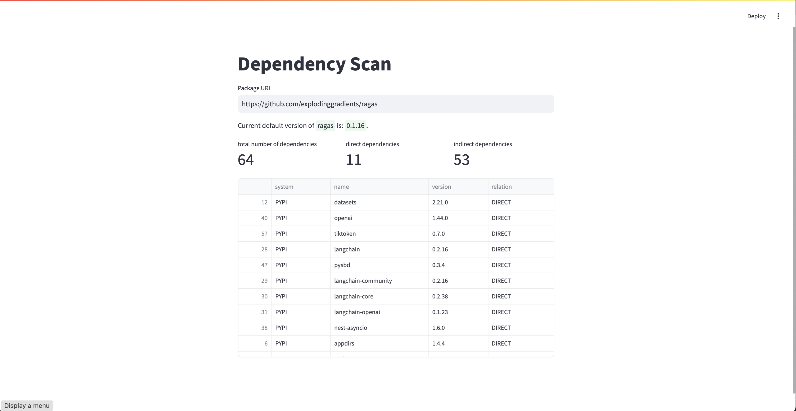
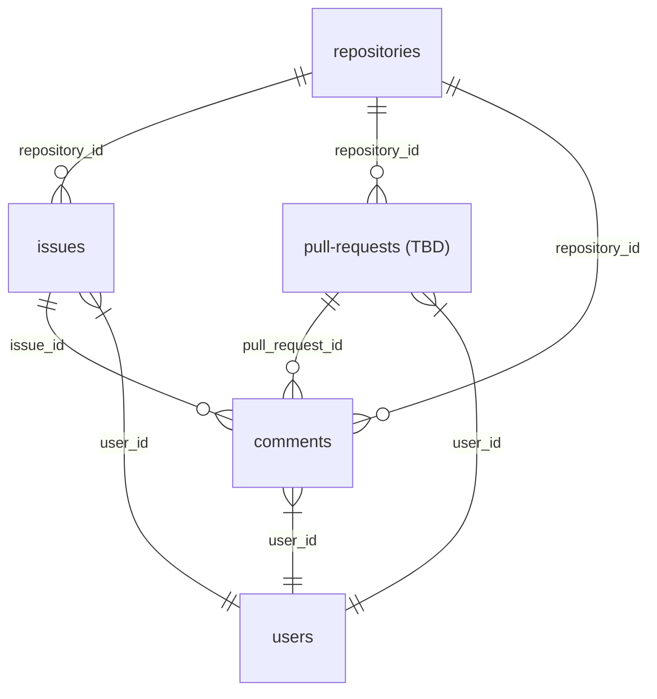

# OpenOwl - Monitoring community health for open-source security

## What is it?

OpenOwl monitorsopen-source project communities. Other tools monitor deterministic security metrics (see e.g. [scorecard.dev](https://scorecard.dev), [oss-fuzz](https://github.com/google/oss-fuzz?tab=readme-ov-file)). OpenOwl focusses on the unstructured communication of open-source projects. 

1. **Monitoring for toxicity and other metrics:** We monitor open-source dependencies by analyzing communication patterns in issues and pull requests. Rather than judging project culture directly, it tracks changes in toxicity levels and other metrics such as length of comment chains, or number of downvotes over time. These metrics serve as early warning signs for community issues, which often lead to increased bugs and vulnerabilities.

### Screenshots
Work in progress screenshot of the web app:


## Getting started - local development with Poetry

Prerequisites:
- Python 3.12
- Poetry
- Copy `.env.example` to `.env` and fill in the variables
- Access to LLM API (currently supported: Anthropic (Claude), TBD: Ollama, OpenAI)

Install dependencies
```Bash
poetry install
```

Start fast-api server
```Bash
poetry run uvicorn openowl.api:app --reload
```

Run Streamlit dashboard
```Bash
poetry run streamlit run openowl/app.py 
```
The dashboard should now be available at http://localhost:8501.

## Getting started - Docker-based development

If you prefer to use docker for development, you can use the provided `docker-compose.yml` file.

Prerequisites:
- Docker
- Docker Compose
- Copy `.env.example` to `.env` and fill in the variables
- Access to LLM API (currently supported: Anthropic (Claude), TBD: Ollama, OpenAI)

Start the docker-based setup with the following command:
```bash
docker-compose up --build
```


## Features 
- See [work-in-progress-notes.md](work-in-progress-notes.md)

## Data structure


```mermaid
erDiagram
    repositories ||--o{ issues : "repository_id"
    repositories ||--o{ "pull-requests (TBD)" : "repository_id"
    repositories ||--o{ comments : "repository_id"
    
    issues ||--o{ comments : "issue_id"
    "pull-requests (TBD)" ||--o{ comments : "pull_request_id"
    
    issues }|--|| users : "user_id"
    "pull-requests (TBD)" }|--|| users : "user_id"
    comments }|--|| users : "user_id"
```