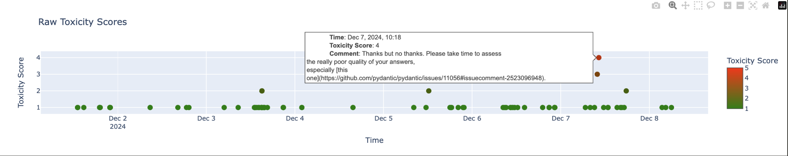

# openOwl - Open Source Monitoring and Security

## Summary
OpenOwl aims to monitor open-source dependencies and related security-relevant information. History has shown, unfortunatly, that communities can become toxic. 

As a potential early indicator, we focus on analyzing the ongoing communication in these open-source projects, which happens in form of issues and pull requests. Here we try to determine toxicity and other relevant metrics and monitor them over time. 

It is important to note that the goal is not to assess and judge a project's culture. Projects are different and have different styles of discussion. We therefore focus on measuring drift over time, where an increasing level of toxicity is almost always a bad sign. 

Dependencies for the Python library Ragas:


One week of comments from the Python library Pandas:


## Features 
- See [work-in-progress-notes.md](work-in-progress-notes.md)


## Getting started

Start fast-api server
```Bash
poetry run uvicorn openowl.api:app --reload
```

Open Streamlit dashboard
```Bash
poetry run streamlit run openowl/app.py 
```

### Docker-based development

If you prefer to use docker for development, you can use the provided `docker-compose.yml` file.

You can start the docker-based setup with the following command:

```bash
docker compose up --build
```

Do not forget to create a GitHub personal access token in GitHub and add it to the `.env` file in the directory `openowl/`. The `.env` file should look like this:

```txt
GITHUB_ACCESS_TOKEN="github_pat_1234567890"
```

## Data structure

```Json
{
    "dependencies": {
        "<dependency_id>": {
            "package_manager": "<string>",  // e.g. "pypi"
            "owner": "<string>",            // e.g. "pandas-dev"
            "name": "<string>",             // e.g. "pandas"
            "version": "<string>",          // e.g. "2.2.3"
            "id": "<string>"                // hash identifier
        }
    },
    "issues": {
        "<issue_number>": {
            "html_url": "<string>",
            "id": "<number>",
            "number": "<number>",
            "title": "<string>",
            "created_at": "<datetime>",
            "updated_at": "<datetime>",
            "closed_at": "<datetime|null>",
            "body": "<string>",
            "author_association": "<string>",
            "comments": "<number>",
            "state": "<string>",            // e.g. "open", "closed"
            "user": {
                "login": "<string>",
                "id": "<number>",
                "site_admin": "<boolean>"
            },
            "reactions": {
                "url": "<string>",
                "total_count": "<number>",
                "+1": "<number>",
                "-1": "<number>",
                "laugh": "<number>",
                "hooray": "<number>",
                "confused": "<number>",
                "heart": "<number>",
                "rocket": "<number>",
                "eyes": "<number>"
            },
            "assignees": [],
            "comments_list": [
                {
                    "url": "<string>",
                    "id": "<number>",
                    "created_at": "<datetime>",
                    "updated_at": "<datetime>",
                    "author_association": "<string>",
                    "body": "<string>",
                    "reactions": {
                        // same structure as issue reactions
                    },
                    "performed_via_github_app": "<any|null>",
                    "user": {
                        // same structure as issue user
                    }
                }
            ]
        }
    },
    "issue_dependency": {
        "<mapping_id>": {
            "issue_id": "<number>",
            "dependency_id": "<string>"      // references dependencies[x].id
        }
    }
}
```
